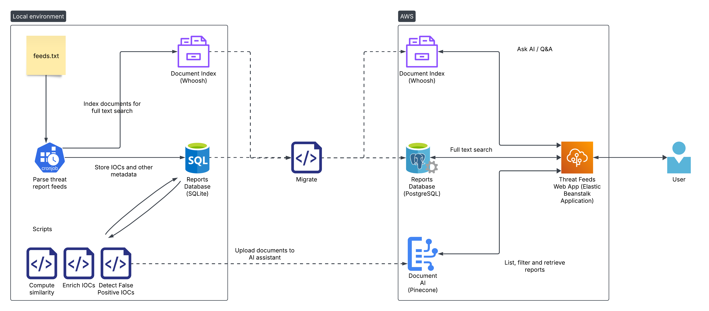

# Threat Feeds

Application URL: http://threat-feeds.us-east-2.elasticbeanstalk.com/

Submission for the [SANS AI Cybersecurity Hackathon](https://ai-cybersecurity-hackathon.devpost.com/).

Threat Feeds is a web application that allows users to browse, search and ask
questions about the latest threat reports published across the security
industry.

## Features

1. Filter threat reports by title, source and publish date
1. Full text search across threat report contents
1. Ask AI any questions on the contents of the threat reports
1. Automatic IOC extraction (hashes, IP addresses, domain names, CVEs, MITRE
   Attack types, YARA rules) for each threat report
1. Automatic context-based false positive IOC detection for each threat report
1. VirusTotal, NIST and MITRE enrichments for IOCs
1. Related reports or "more like this" feature for each threat report
1. APIs for listing and searching reports, retrieving a particular report and
   the Q&A feature.

## Architecture


## Scripts

Jupyter notebooks were used for quick iteration, but are structured in such
a way that they can be run as-is by converting them into Python scripts using
the command
```
jupyter nbconvert --to script <script>.ipynb
```

1. [threat_report_parsing.ipyb](threat_report_parsing.ipynb): Crawl the latest
   pages from [the RSS feeds](feeds.txt), store the raw page data, parsed
   page data, extract IOCs, persist the metadata and index the documents into
   a Whoosh search index.
1. [false_positive_iocs.ipynb](false_positive_iocs.ipynb): Run an LLM over each
   IOC extracted from a report along with its context, and determine if the IOC
   is valid and relevant.
1. [enrich_reports.ipynb](enrich_reports.ipynb): For each hash found in
   a report, link the VirusTotal URL if it exists. For each MITRE Attack IOC
   found in a report, link the corresponding page on MITRE.
1. [similarity.ipynb](similarity.ipynb): Compute related reports for each
   report by chunking them up, computing embeddings and storing them in
   ChromaDB. Also upload the documents to a Pinecone Assistant for the Q&A
   feature.
1. [migrate.ipynb](migrate.ipynb): All the necessary data is copied over to an
   AWS PostgreSQL instance that is the actual "production" instance that the
   app interacts with.

## Updating Feeds

Considering this is a hackathon submission, the solution to update the latest
reports is pretty hacky. Run the scripts in the following order.

1. [threat_report_parsing.ipyb](threat_report_parsing.ipynb)
1. [false_positive_iocs.ipynb](false_positive_iocs.ipynb)
1. [enrich_reports.ipynb](enrich_reports.ipynb)
1. [similarity.ipynb](similarity.ipynb)
1. [migrate.ipynb](migrate.ipynb)

## Deploy the app
From the [eb-flask](eb-flask/) directory, run the following
```
zip ../eb-flask.zip -r * .[^.]* -x __pycache__/\* -x flask-app-venv/\*
```
Upload the compressed file to AWS Elastic Beanstalk.

## Future Work

1. User generated content
   - Votes and comments
   - Upload custom, private threat reports
   - Share threat reports privately
1. Chatbot for longer conversations about the threat report contents
1. Integrations - OpenCTI, SOAR enrichment plugins etc.
